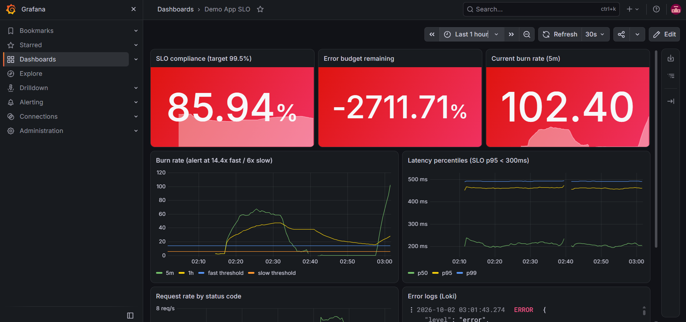
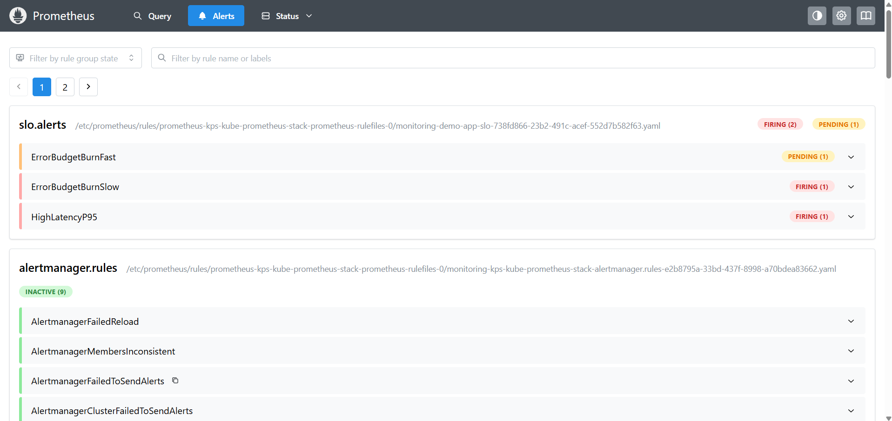
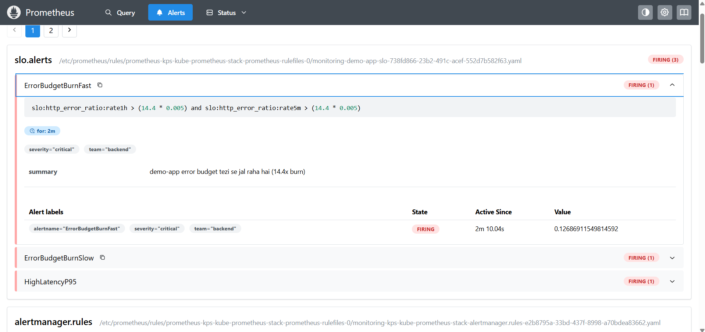
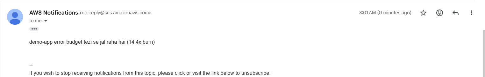
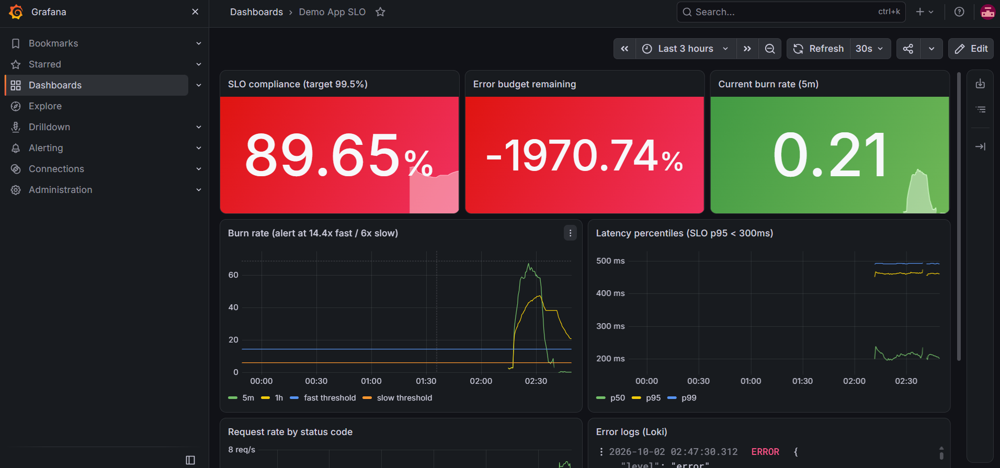

# Centralized Observability Stack (k3s on AWS EC2)

Prometheus + Grafana + Loki + Alertmanager deployed with Helm on a single-node k3s cluster (AWS EC2 free tier).
App metrics and logs are centralized, with custom SLO dashboards and burn-rate alerts routed to AWS SNS (email).

## Architecture

```
demo-app --/metrics--> Prometheus --> Alertmanager --> AWS SNS --> Email
   |                       |
   +--stdout--> Alloy --> Loki
                           |
              Grafana <----+---- (SLO dashboards + logs)
```

## Components

- kube-prometheus-stack (Helm): Prometheus, Alertmanager, Grafana, node-exporter, kube-state-metrics
- Loki (SingleBinary, filesystem storage) + Grafana Alloy for pod log collection
- demo-app (Flask): `http_requests_total`, latency histogram, JSON logs
- AWS SNS + EC2 IAM role: alert delivery without static credentials

## SLOs

- Availability 99.5% (error budget 0.5%)
- Latency p95 < 300ms
- Multi-window burn-rate alerts: 14.4x (critical), 6x (warning), plus a p95 latency alert

## Repo layout

- `helm-values/`: kube-prometheus-stack.yaml, loki.yaml, alloy.yaml
- `apps/demo-app/`: app.py, Dockerfile, k8s.yaml (with ServiceMonitor)
- `slo/`: slo-rules.yaml (recording rules and alerts)
- `dashboards/`: build_slo.py, slo.json
- `docs/`: screenshots

## Setup

1. EC2 (Ubuntu, 4GB RAM, 30GB+ disk) with an IAM role allowing `sns:Publish`, and IMDS hop limit set to 2.
2. Install k3s (`--disable traefik`) and Helm.
3. Replace `CHANGE_ME` (Grafana password) and `ACCOUNT_ID` (SNS topic ARN) in `helm-values/kube-prometheus-stack.yaml`.
4. Deploy with `helm install` for kps, loki and alloy; build and import the demo-app image; apply `k8s.yaml` and `slo/slo-rules.yaml`.
5. Create the dashboard:

```bash
GRAFANA_AUTH='admin:YOUR_PASSWORD' python3 dashboards/build_slo.py
```

## Failure demo

```bash
# inject 50% errors
kubectl -n demo set env deploy/demo-app ERROR_RATE=0.5

# about 10-15 min later ErrorBudgetBurnFast fires and an email [CRITICAL][FIRING] arrives

# recover
kubectl -n demo set env deploy/demo-app ERROR_RATE=0.002
```

## Screenshots

### SLO dashboard during fault injection (burn rate ~100x, above the 14.4x threshold)


### Alert lifecycle: pending, then firing


### ErrorBudgetBurnFast firing in Prometheus


### Alert delivered via Alertmanager, SNS and email


### After recovery


## Notes

- Runs on k3s to stay within the free tier. On EKS, only storage (S3) and IRSA would change.
- No secrets are committed. Alertmanager uses the EC2 instance role for SNS.
